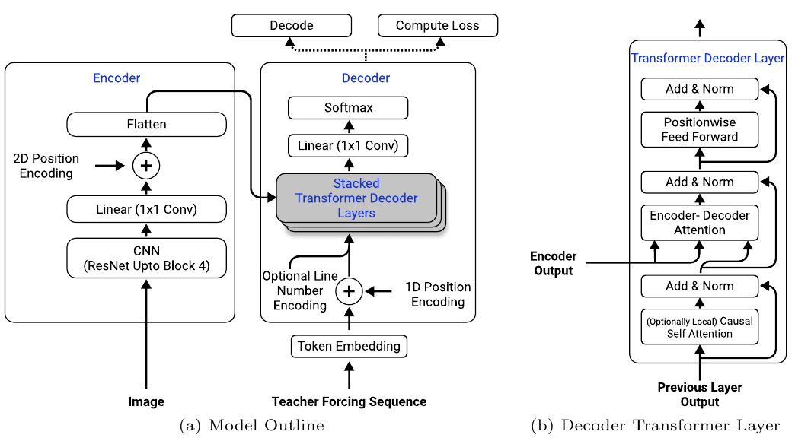

# Full Page Handwriting Recognition
Implementation of the paper "Full Page Handwriting Recognition via Image to Sequence
Extraction" by Singh et al. (2021) ([Arxiv link](https://arxiv.org/abs/2103.06450)).



## How to run

In the current implementation, the IAM dataset is used for training the model. Download
the dataset
[here](https://fki.tic.heia-fr.ch/databases/download-the-iam-handwriting-database)
(requires creating an account).

After downloading IAM, install the requirements:

```shell
pip install -r requirements.txt
```

Now run the main script, e.g.

```shell
python src/main.py --data_dir /path/to/IAM --data_format form --max_epochs 3 --use_cpu
```

NOTE: running this model on full page images can quickly lead to out-of-memory errors,
since unprocessed form images from IAM can be up to 2479x3542 in size -- much larger
than your average neural network images.  Consider reducing the batch size to a low
value to make training more managable, and perhaps use gradient accumulation to
compensate for the low batch size (can be specified as an argument).

Besides training on form images from the IAM dataset, the model can alternatively be
trained on line or word images, which are included in the IAM dataset.  This makes
training (or even loading) a model easier, since these images are much smaller. Specify
this using the `--data_format {form,line,word}` flag.

For more command line options, see `main.py`, or run `python main.py -h` for a list of
all options.

## How to view logs
During training, different metrics are logged to Tensorboard, as well as intermediate
predictions on a fixed batch of data. These are stored in the `lightning_logs` folder.
To view the Tensorboard logs, run the following from the root directory:

```shell
tensorboard --logdir lightning_logs
```

This will provide a localhost link to the Tensorboard dashboard.

## TODO
- Implement synthetic data augmentation, as specified on p.10 of the paper
