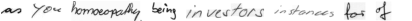

# Full Page Handwriting Recognition
Implementation of the paper "Full Page Handwriting Recognition via Image to Sequence
Extraction" by Singh et al. (2021) ([Arxiv link](https://arxiv.org/abs/2103.06450)).


## How to run

In the current implementation, the IAM dataset is used for training the model. Download
the dataset
[here](https://fki.tic.heia-fr.ch/databases/download-the-iam-handwriting-database)
(requires creating an account).

After downloading IAM, install the requirements:

```shell
pip install -r requirements.txt
```

Now run the main script, e.g.

```shell
python src/main.py --data_dir /path/to/IAM --data_format form --max_epochs 3 --use_cpu
```

NOTE: running this model on full page images can quickly lead to out-of-memory errors,
since unprocessed form images from IAM can be up to 2479x3542 in size -- much larger
than your average neural network images.  Consider reducing the batch size to a low
value to make training more managable, and perhaps use gradient accumulation to
compensate for the low batch size (can be specified as an argument).

Besides training on form images from the IAM dataset, the model can alternatively be
trained on line or word images, which are included in the IAM dataset.  This makes
training (or even loading) a model easier, since these images are much smaller. Specify
this using the `--data_format {form,line,word}` flag.

For more command line options, see `main.py`, or run `python main.py -h` for a list of
all options.

## How to view logs
During training, different metrics are logged to Tensorboard, as well as intermediate
predictions on a fixed batch of data. These are stored in the `lightning_logs` folder.
To view the Tensorboard logs, run the following from the root directory:

```shell
tensorboard --logdir lightning_logs
```

This will provide a localhost link to the Tensorboard dashboard.

## Synthetic data augmentation
Additionally, this repo includes an implementation of one of the synthetic data
augmentation schemes used in the paper, namely combining individual words from IAM
to create new line or form images. Below are two examples of generated line
images.




As of right now, the words are sampled (mostly) randomly, which means
that most often the sentences are not really interpretable. However, initial experiments
suggest that the synthetic data augmentation can significantly improve performance on
the validation set.

This synthetic data augmentation can be included in training by setting
the `--synthetic_augmentation_proba` flag, which indicates the probability of applying
the synthetic data augmentation. For example, setting
`--synthetic_augmentation_proba 0.3` means that in every batch, roughly 30% will consist
of synthetic data.

## Preliminary results

The table below provides preliminary results on line images, without any hyperparameter
finetuning, using Resnet18 as image encoder. Note that synth. aug. indicates the use of
synthetic data augmentation.

| Model               | CER   | WER   |
|---------------------|-------|-------|
| FPHTR               | 28.9% | 38.4% |
| FPHTR + synth. aug. | 9.4%  | 17.0% |

Again, these numbers are without any kind of hyperparameter optimization, so they
most likely do not represent the best possible performance.
