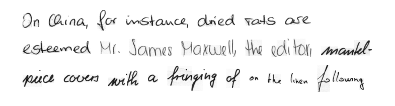

# Full Page Handwriting Recognition
Implementation of the paper "Full Page Handwriting Recognition via Image to Sequence
Extraction" by Singh et al. (2021) ([Arxiv link](https://arxiv.org/abs/2103.06450)).


_NOTE: I have not been able to reproduce the results from the original paper on full
pages. Even though I succesfully managed to train models for word and line images,
training on full-page images always leads to overfitting in all configurations I tried
thus far. I have followed the implementation details from the paper as closely as
possible (including the synthetic data augmentation scheme to create additional data,
explained [below](user-content-synthetic-data-augmentation)),
but no configuration has lead to a word error rate below 95% on the validation set. I
might try doing some more hyperparameter tuning in the future to try and improve
performance, but nothing has shown promise so far._

## How to run

In the current implementation, the IAM dataset is used for training the model. Download
the dataset
[here](https://fki.tic.heia-fr.ch/databases/download-the-iam-handwriting-database)
(requires creating an account).

After downloading IAM, install the requirements:

```shell
pip install -r requirements.txt
```

Now run the main script to train a model, e.g.

```shell
python src/main.py --data_dir /path/to/IAM \
                   --data_format form \
                   --max_epochs 3 \
                   --synthetic_augmentation_proba 0.4 \
                   --precision 16 \
                   --use_aachen_splits \
                   --use_cpu \
```

NOTE: running this model on full page images can quickly lead to out-of-memory errors,
since unprocessed form images from IAM can be up to 2479x3542 in size -- much larger
than your average neural network images.  Consider reducing the batch size to a low
value to make training more managable, and perhaps use gradient accumulation to
compensate for the low batch size (can be specified as an argument).

Besides training on form images from the IAM dataset, the model can alternatively be
trained on line or word images, which are included in the IAM dataset.  This makes
training (or even loading) a model easier, since these images are much smaller. Specify
this using the `--data_format {form,line,word}` flag.

To run inference on a trained model using your own images, use the following command:

```shell
python src/inference.py --img_path /path/to/img --model_path /path/to/model --data_format {word,line,form}
```

This means the model at `--model_path` will be loaded and applied to the image at
`--img_path`. The `--data_format` argument is determined by the data format you used to
train your model.

For more command line options, see `main.py`, or run `python main.py -h` for a list of
all options.

## How to view logs
During training, different metrics are logged to Tensorboard, as well as intermediate
predictions on a fixed batch of data. These are stored in the `lightning_logs` folder.
To view the Tensorboard logs, run the following from the root directory:

```shell
tensorboard --logdir lightning_logs
```

This will provide a localhost link to the Tensorboard dashboard.

## Synthetic data augmentation

Additionally, this repo includes an implementation of the synthetic data augmentation
scheme used in the paper, namely combining random spans of words from IAM to create new
line or form images. Below is an example of a generated form image (for more examples,
check out the notebook `synthetic_data_augmentation.ipynb`).



This synthetic data augmentation can be included in training by setting
the `--synthetic_augmentation_proba` flag, which indicates the probability of applying
the synthetic data augmentation. For example, setting
`--synthetic_augmentation_proba 0.3` means that on average, 30% of every batch will
consist of synthetic data.

## Preliminary results

The table below provides preliminary results for line images on the IAM validation set,
without any hyperparameter finetuning. Note that synth. aug. indicates the use of
synthetic data augmentation.

| Model                        | CER   | WER   |
|------------------------------|-------|-------|
| FPHTR Resnet18               | 28.9% | 38.4% |
| FPHTR Resnet18 + synth. aug. | 9.0%  | 16.5% |
| FPHTR Resnet34 + synth. aug. | 8.8%  | 14.0% |

Again, these numbers are without any kind of hyperparameter optimization, so they
most likely do not represent the best possible performance.
